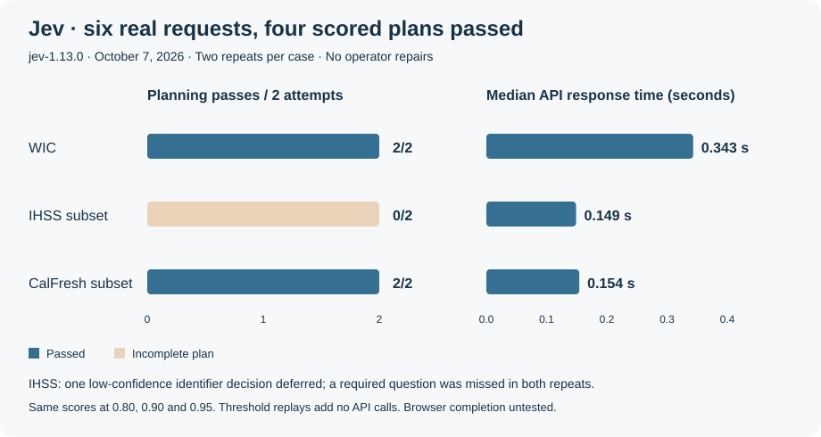
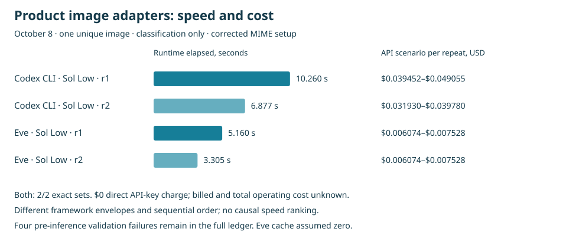
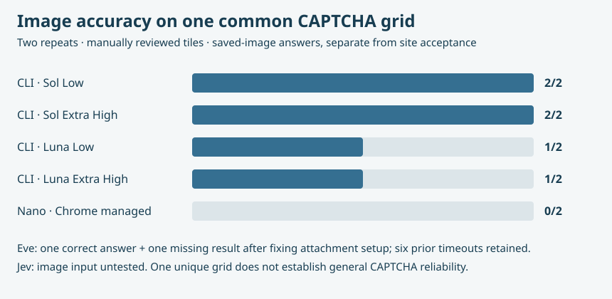
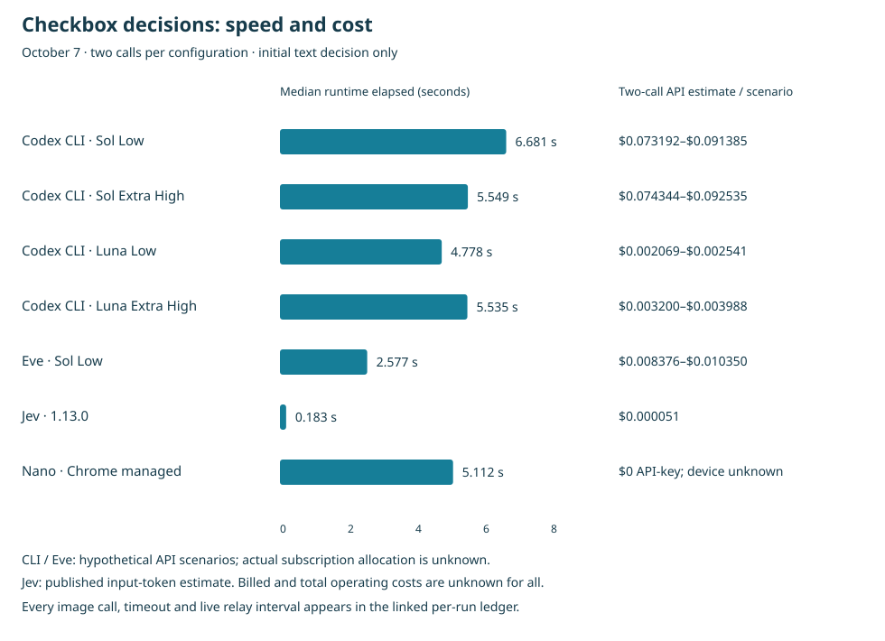
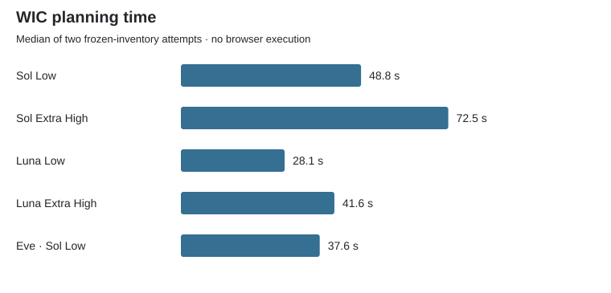
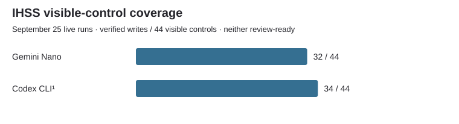
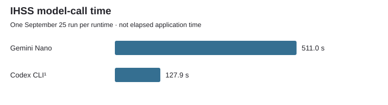

# Nava Benefit Form Assistant Chrome Extension

An experimental Chrome extension that helps a caseworker prepare benefit forms, review missing answers, and verify the values it fills. **The caseworker reviews and submits. The extension never submits an application.**

Version **0.14.0** · Nava Labs tester release · October 8, 2026

## Test results

**Latest installed v14 batch · October 9:** four fresh WIC form runs, **0/4 correct completions**, zero operator answer repairs. Nano/Codex reached CAPTCHA with incomplete addresses; Jev paused on unnecessary questions. No new native CAPTCHA action has been attempted yet. The remaining repeats and image-runtime matrix are pending, not measured failures.

| Installed form run | Time to stopped checkpoint | Correct answers | Prompts | Usage | API cost basis | CAPTCHA in this batch |
|---|---:|---:|---:|---|---|---|
| Nano 1 · Chrome-managed model/effort | 243.3 s | 16/17 | 9 | 23,718 context units; API tokens unavailable | $0 API charge; device cost unknown | Reached; not attempted |
| Jev 1.13.0 · repeat 1 | 8.39 s | 15/17 | 2 | 36,848 input / 15,762 output tokens | $0.001547616 estimate; billed unknown | Not reached; questions |
| Jev 1.13.0 · repeat 2 | 8.45 s | 15/17 | 2 | 36,848 input / 15,763 output tokens | $0.001547616 estimate; billed unknown | Not reached; questions |
| Codex CLI default · repeat 1 | 116.5 s | 16/17 | 9 | 178,677 input / 3,638 output tokens | $0 direct API-key charge; model-price estimate unknown | Reached; not attempted |

These are **times to a stopped workflow**, not successful completion speeds. All four omit city/state/ZIP from Home Address. Jev leaves Medi-Cal unanswered and asks two not-applicable questions; Codex also fills the conditional mailing-address box unnecessarily, outside the 17-answer denominator. v14's Codex form route does not specify model/reasoning, so it is not attributed to this chat's model. [Full new run details and stage timings](docs/INSTALLED_V014_BATCH.md) · **[Error catalog and reproduction steps](docs/BENCHMARK_ERRORS.md)** · [JSON](evaluation/results/installed-v014-oct9.json) · [CSV](evaluation/results/installed-v014-oct9.csv).

**Live application quality remains unfinished: 0/8 October 5 workflows reached unassisted final review.** The newer tests below measure field planning only, using frozen controls and fictional records. They do not show complete government applications.

| Tested configuration | WIC planning | IHSS subset | CalFresh subset | WIC median time | WIC model-price estimate¹ |
|---|---:|---:|---:|---:|---:|
| Codex CLI · GPT-6.1 Sol Low | 2/2 | 2/2 | 0/2 | 48.8 s | $0.1123–$0.1370 |
| Codex CLI · GPT-6.1 Sol Extra High | 2/2 | 2/2 | 1/2 | 72.5 s | $0.1231–$0.1478 |
| Codex CLI · GPT-6 Luna Low | 2/2 | 2/2 | 1/2 | 28.1 s | $0.0048–$0.0059 |
| Codex CLI · GPT-6 Luna Extra High | 2/2 | 2/2 | 1/2 | 41.6 s | $0.0058–$0.0070 |
| Eve 0.71.2 · GPT-6.1 Sol Low | 2/2 | 2/2 | 2/2 | 37.6 s | $0.0370–$0.0427 |
| Jev 1.13.0 · decision stage | 2/2 | 0/2 | 2/2 | 0.343 s | $0.000607 |

Passed / attempted, with two repeats per case. CLI/Eve use three planning role calls per attempt; Jev uses one choice-classification request. Prompts, task contracts and provider routes differ: this is a system comparison, not an isolated model or harness speed ratio. Requested CLI/Eve models are recorded; only Jev returned a provider-resolved model ID.

¹ CLI/Eve prices are hypothetical API scenarios; those runs used subscription access. Jev prices use measured input tokens and [TypeSafe's published rate](https://docs.typesafe.ai/models); the six Jev calls total about **$0.00213 estimated**, with no invoice verified. Total operating cost and cost per completed application remain unknown.



The original classifier-only Jev pilot missed a required IHSS question after low-confidence deferral. Version 0.13 adds explicit missing-answer questions, a protected Jev companion and a selectable extension runtime. Its transport/planner tests are below; October 9 now adds two actual installed WIC executions, both blocked by unnecessary questions before CAPTCHA.

### Gemini Nano and playbook results

**Live Nano WIC:** 15/17 and 16/17 answers matched before help. They reached 17/17 only after **2 and 3 operator answer interventions**, respectively. Journeys took 21.7 and 28.5 minutes, including waiting and help; both paused at CAPTCHA. Historical IHSS verified 32/44 visible controls, which measures persisted writes rather than answer correctness. Both CalFresh attempts encountered runtime/false-gap/recovery failures and have no complete quality score. Nano has no per-token API charge; device and operating costs were not measured.

The separate local WIC experiment ran the same frozen 17-answer task twice per variant:

| Configuration | AI calls per attempt | Repeat 1 | Repeat 2 | Local wall time, repeats 1 / 2 |
|---|---:|---|---|---:|
| Gemini Nano · original three-role planner | 3 | 16/17 | 16/17 | 69.2 s / 81.2 s |
| Deterministic JavaScript site playbook | 0 | 17/17 | 17/17 | 3.1 ms / 1.2 ms |
| Gemini Nano · compact guided playbook | 1 | 17/17 | **Invalid JSON; fill never started** | 8.7 s / 16.0 s |

These are local source-agreement scores after DOM readback, not complete government applications. The fast demo uses **JavaScript rules, not a shell script**. No evidence establishes that Foad's Scribe generated it. The guided variant changes call count, prompt size, output format and address composition together; it is not a prompt-only A/B test. One faster success and one parsing failure do not establish reliability. Chrome's exact Nano model version and reasoning setting were not exposed in the recorded runs. [All six playbook attempts](evaluation/results/nano-playbook-summary.json) · [All live metrics](evaluation/results/live-summary.json)

### Jev through the extension planner · October 7

| Prompt / integration batch | WIC | IHSS subset | CalFresh subset | Calls | DOM execution |
|---|---:|---:|---:|---:|---|
| First integration prompt | 0/2 | 2/2 | 2/2 | 6 | Not tested |
| Explicit field identifiers and hints · current v0.13 | 1/2 | 2/2 | 0/2 | 6 | Not tested |

Both batches used the actual extension planner, authenticated loopback companion and real `jev-1.13.0` API at confidence **0.90**. No operator repaired an answer. All attempts are retained, including the first batch. Jev exposes no configurable reasoning effort here; confidence is a decision threshold, not a reasoning setting. Required low-confidence classifications become caseworker questions. That repaired the silent IHSS omission, but the current batch deferred WIC clinic/text/Medi-Cal and CalFresh housing/county controls. No incorrect approved mappings were observed. Changing the prompt did not consistently improve quality.

The current batch's API durations were 0.133–0.268 seconds; planner wall time was 0.136–1.330 seconds, with startup health checking in the first attempt. The six calls cost **about $0.00228 at published input-token rates**, with billed cost unknown. These tests do not exercise live-site navigation, composite address accuracy, or final review. [First batch](evaluation/results/jev-extension-planning-initial.json) · [Current batch](evaluation/results/jev-extension-planning.json)

### Which model clicked through CAPTCHA?

**October 9 native status: 0 attempts, 0 accepted states.** Nano and Codex each have a filled WIC page staged at CAPTCHA; Jev's two workflows stopped at questions. No image runtime has been called in this fresh installed batch. This is pending coverage, not a 0% model accuracy score. [Exact current results, speed/cost and remaining work](docs/INSTALLED_V014_BATCH.md#which-models-completed-captcha).

**New in v0.14:** a native extension executor, separate from the earlier Codex browser relay. Four mechanical browser-fixture checks passed; native live-provider acceptance remains unverified. The new product image adapters also ran twice on the same saved grid:

| Product image adapter · requested GPT-6.1 Sol Low | Exact tile sets | Elapsed time, repeat 1 / 2 | API-price scenario, repeat 1 / 2¹ |
|---|---:|---:|---:|
| Codex CLI | 2/2 | 10.260 s / 6.877 s | $0.039452–$0.049055 / $0.031930–$0.039780 |
| Eve 0.71.2 | 2/2 | 5.160 s / 3.305 s | $0.006074–$0.007528 / $0.006074–$0.007528 |

¹ Subscription runs: $0 direct API-key charges; billed, subscription allocation and operating cost unknown. Eve’s scenario assumes no cached input because cache counters were not retained. This is **one unique image**, classification only, with different framework envelopes and sequential order. Four initial MIME-validation failures were rejected before inference and are retained in the [full speed/cost table](docs/CAPTCHA_RUN_METRICS.md). [Native setup and limits](docs/CAPTCHA_ACTUATOR.md).



**October 7: 14 live WIC attempts, 12 confirmed accepted and 2 inconclusive because capture or challenge preparation took too long.** All 14 model decisions chose the correct checkbox action. A shared Codex browser relay performed the clicks; the tested runtimes had no native browser tools. The application was empty and Submit stayed untouched.

| Requested runtime / setting | Accepted / browser attempts | Image sessions completed | Inconclusive |
|---|---:|---:|---:|
| Gemini Nano · Chrome-managed version/effort | 2/2 | 0 encountered | 0 |
| Jev 1.13.0 · confidence 0.90, no reasoning control | 2/2 | 0 encountered | 0 |
| Eve 0.71.2 · GPT-6.1 Sol Low | 2/2 | 0 encountered | 0 |
| Codex CLI · GPT-6.1 Sol Low | 1/2 | 0 encountered | 1 |
| Codex CLI · GPT-6.1 Sol Extra High | 1/2 | 0 completed; 1 expired | 1 |
| Codex CLI · GPT-6 Luna Low | 2/2 | **1 completed, first answer accepted** | 0 |
| Codex CLI · GPT-6 Luna Extra High | 2/2 | **1 completed after a rejected answer** | 0 |

Luna Low selected four bridge tiles correctly. Luna Extra High's 4×4 traffic-light selection received **“Please try again”**; its bicycle follow-up was accepted. These are two completed image sessions and three submitted image answers, of which two were accepted. Shared browser history, sequential order and different challenge types prevent a fair live model ranking. CLI model identities are requested flags, not provider-resolved attestations.

A separate comparison used the **same captured 3×3 traffic-light grid twice per configuration**, with manually reviewed matching tiles 1, 8 and 9:

| Image classifier | Exact matching tile sets / repeats | Response time, repeats 1 / 2 |
|---|---:|---:|
| Codex CLI · GPT-6.1 Sol Low | 2/2 | 6.75 s / 5.21 s |
| Codex CLI · GPT-6.1 Sol Extra High | 2/2 | 13.95 s / 18.32 s |
| Codex CLI · GPT-6 Luna Low | 1/2; second missed one tile | 4.59 s / 4.82 s |
| Codex CLI · GPT-6 Luna Extra High | 1/2; second refused | 7.69 s / 6.01 s |
| Gemini Nano · Chrome managed | **0/2; selected all nine tiles both times** | 11.84 s / 6.16 s |
| Eve · GPT-6.1 Sol Low · corrected attachment setup | 1 correct set; 1 absent structured result | 10.95 s / 3.10 s |
| Jev 1.13.0 | Image input not tested on the text/JSON route | — |

These repeats cover **one unique image**, not general CAPTCHA accuracy. Saved-image answers were not submitted to that expired challenge. Nano's successful ordinary-shape image checks did not transfer to this grid. Eve's first six attachment trials timed out. After correcting the image task contract, exporting an in-memory staging environment and restarting the service, one repeat returned the correct set; the other returned no structured result. Its missing result has no recorded reason and is not labeled a refusal. All eight Eve attempts and CLI startup failures are retained.

The two Jev checkbox decisions took 0.241 s and 0.124 s, with **$0.000050904 total input-token price estimate** and unknown billed cost. Nano decisions took 8.02 s and 2.20 s. CLI/Eve used subscription access; device, subscription, relay and review costs were not allocated. This benchmark does not measure cost per completed application.

**Extension status:** v0.14 adds a native, opt-in reCAPTCHA actuator: one authorization covers the checkbox and up to three static image rounds. It uses no Codex browser relay. The prior live results above still belong to the external relay, and cannot be relabeled native successes. Native fixture checks passed; installed WIC form planning/filling now ran four times, while native CAPTCHA execution and live-provider acceptance remain unverified. Provider pages may reject synthetic DOM clicks. The Codex browser tool's external action-time policy remains outside this repository.





**Speed and cost for every run:** [all individual attempts, failures and unknowns](docs/CAPTCHA_RUN_METRICS.md) · [machine-readable metrics](evaluation/results/captcha-run-metrics.json). Runtime time includes startup; pure model time and browser observation intervals are separate where recorded. Cost estimates are not invoices; billed and total operating costs are unknown. Untimed historical/startup attempts remain explicitly unknown.

[All 14 action and browser trials](evaluation/results/captcha-oct7-actions.json) · [Every image answer and failure](evaluation/results/captcha-oct7-images.json) · [Summary counts](evaluation/results/captcha-oct7-summary.json) · [Reproduce the pilot](evaluation/captcha/README.md)

The separate October 5 chat trial (GPT-6.1 Sol Extra High) accepted one checkbox without images; it is retained as historical evidence and excluded from the new two-repeat matrix. [Historical summary](evaluation/results/captcha-summary.json)

[Read the findings and limitations](docs/BENEFIT_SITE_EVALUATION.md) · [Inspect all measured result tables](evaluation/results/README.md) · [Run the frozen benchmark](evaluation/controlled-planning/README.md)

<details>
<summary>More charts: WIC planning speed and historical IHSS completeness</summary>







The IHSS charts are one historical run per runtime. Readback coverage measures persisted writes, not correct answers or complete applications; the historical CLI model was not captured.

</details>

## What it does today

- Imports a client record from labeled JSON, a reviewed document, or a configured read-only organization connector. Bundled records are fictional.
- Uses a mapper, gap analyst, and reviewer to plan field assignments. Gemini Nano runs on the device; optional Codex and Claude CLIs use a paired local companion. Experimental Jev classifies field purposes through that companion, with local validation and explicit questions for uncertain answers.
- Fills approved values, reads them back, asks for missing answers, and follows approved Next/Continue steps. Known-site adapters cover Riverside WIC, Riverside IHSS, and parts of BenefitsCal.
- Tracks several applications, pauses and resumes checkpoints, and exports a value-free activity log.
- Shows a prototype recertification workspace for upcoming renewals, updates, and client authorization.

**What remains unfinished:** no saved live-site trial reached unassisted final review. Address completeness, missing decisions, and long BenefitsCal flows need work. Native CAPTCHA automation is experimental and has no verified live-provider run. One-time codes, unsupported challenges and final submission require a person. Eve remains a separate form-planning harness and is now an optional image classifier for the native actuator. Jev's two installed WIC executions filled known values but stopped at unnecessary questions. [Current error details](docs/BENCHMARK_ERRORS.md).

Read [the current testing writeup](docs/BENEFIT_SITE_EVALUATION.md), or [the developer guide](DEVELOPER_GUIDE.md).

## Try it in 10 minutes

Use desktop Chrome 138+ and fictional data. No production database or paid API key is required for the local fixture. Gemini Nano still needs a supported device and an available Chrome built-in AI runtime; enabling it may download a model.

1. Download this repository with **Code → Download ZIP**, unzip it, or clone it. Select the folder containing `manifest.json` when installing.
2. Open `chrome://extensions`, turn on **Developer mode**, choose **Load unpacked**, and select that folder.
3. In a terminal inside the folder, run `python3 -m http.server 4173 --bind 127.0.0.1`.
4. Open `http://127.0.0.1:4173/demo/extensive-application.html?step=1&reset=1`.
5. Click the extension icon. Keep Gemini Nano under **Model runtime** and choose **Enable agentic AI**.
6. Choose **Paste client JSON → Use a fictional sample record → Continue**. Choose **Analyze this form**, then continue.
7. Review questions and every filled value. Verify the runner stops before certification and Submit. Export the activity log from the dashboard.

If the model is unavailable, the extension reports an error. For the subscription CLI or Jev alternatives, follow [the companion setup](model-bridge/README.md). To explore just the interface without installing or running AI, open `http://127.0.0.1:4173/sidepanel/index.html?preview=1&demo=1`; this preview simulates results and is not a model test.

## Native CAPTCHA automation · v0.14

All form runtimes share the same deterministic checkbox executor; a checkbox click needs no model request. It is a browser mechanism, not evidence that each model can solve an image.

| Runtime | Checkbox executor | Static 3×3 / 4×4 image classification |
|---|---|---|
| Gemini Nano | Shared native executor | On-device Prompt API; prior common-grid accuracy 0/2 |
| Codex CLI | Shared native executor | Cropped image + constrained tile indexes; model and Low/Extra High selectable |
| Eve | Shared native executor | Optional loopback image agent, GPT-6.1 Sol Low |
| Jev 1.13.0 | Shared native executor | Current text/JSON route has no image adapter; choose a separate image runtime |
| Claude CLI | Shared native executor | Image adapter not implemented here; choose a separate image runtime |

Open an application card’s **CAPTCHA automation** disclosure and enable **Allow one CAPTCHA attempt during this run** before **Fill through application**. The runner can then try the checkbox and follow-ups without a new prompt at that checkpoint. At an existing CAPTCHA checkpoint, choose **Authorize and try CAPTCHA** once. **Model runtime → CAPTCHA images** selects the image classifier; Codex/Eve need the paired companion. [Companion setup](model-bridge/README.md#native-captcha-images--v014).

The authorization ends after the attempt, page/document change, Pause, session change, or a three-minute expiry. Only recognized reCAPTCHA controls are executable; images are cropped to the visible grid. The actuator observes visible checkbox acceptance and never reads/writes CAPTCHA tokens or clicks application Submit. Dynamic replacement grids, audio, hCaptcha, Turnstile, hidden/multiple widgets and unsupported layouts hand off. Provider rejection and model refusal also remain visible failures.

**Verification:** the actual frame adapter passed four deterministic browser-fixture checks in both browser-fixture repeats (**5.4 / 6.4 ms**), with zero model calls and $0 direct API-key charge. This is mechanical execution on a simulation, not live CAPTCHA accuracy, complete application speed, or installed Chrome verification. To reproduce, use the local server above and open `http://127.0.0.1:4173/demo/captcha-fixture.html`; run the self-test once from a reset fixture. [Native implementation and test scope](docs/CAPTCHA_ACTUATOR.md).

## Testing this sprint

[The tester guide](docs/TESTER_GUIDE.md) gives repeatable tasks, expected behavior, known issues, and a findings template. Start with the local fixture; live government sites should use only approved synthetic test data and stop before any submission.

## Product demo

[Watch the recorded demo (MP4)](docs/assets/nava-form-filling-assistant-demo.mp4)


This recording shows an earlier local fixture build. It illustrates the workflow, not current model speed or successful completion of a government application.

## Development and evaluation

```sh
npm ci
npm run check
npm test
```

The runnable [controlled evaluation harness](evaluation/controlled-planning/README.md) and [reviewed result tables](evaluation/results/README.md) distinguish planning quality, DOM execution, and full journeys. [Protected Jev access](docs/JEV_TEST_ACCESS.md) documents the completed API pilot and protected rerun instructions.

This Nava organization repository preserves the history of [the original prototype](https://github.com/gobrando/nava-form-filling-assistant-chrome-extension), starting from `0a015b446a709095c9f0ebac9638f483cc67f8a1`. The public release branches from the already-public prototype; new raw live-site audits and private API source snapshots are excluded. This is a research prototype, not a production benefit service.
