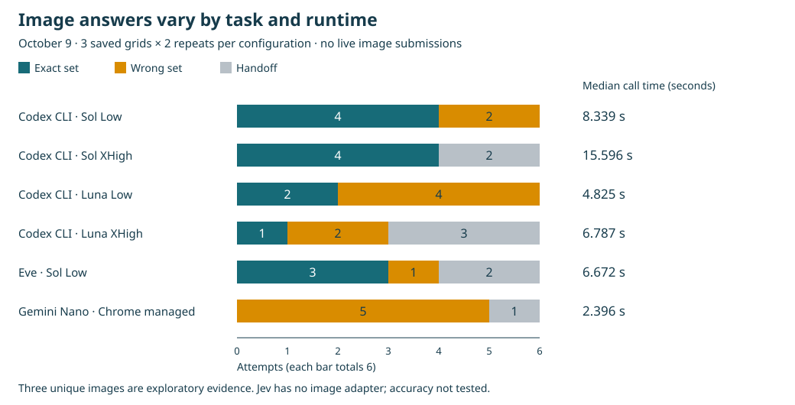

# Fresh CAPTCHA tests · October 9

**36 fresh image classifications and three installed native attempts are retained.** The shared native executor visibly accepted two WIC checkboxes, in **2.494 s and 1.882 s**, with **zero image-model calls and $0 marginal API cost**. The initial offscreen attempt handed off in 0.031 s; both accepted attempts followed operator viewport preparation. Application Submit stayed untouched.

**One post-CAPTCHA workflow reached final review; neither correctly completed the form.** The Codex-origin workflow reached `ready_for_review` 39.105 s after acceptance, but still had an incomplete home address and an unnecessary mailing fill. The Nano-origin page continued with the globally configured CLI default, then stopped at `navigation_unknown` 75.357 s after acceptance. This is not a Nano-only completion. Exact underlying CLI continuation model/effort were not recorded.

[Every error with exact run/model provenance](BENCHMARK_ERRORS.md#exact-run-provenance) · [Every CAPTCHA run’s speed, tokens and cost](CAPTCHA_RUN_METRICS.md) · [36 image receipts](../evaluation/results/captcha-three-crops-oct9.json) · [Three native receipts and continuation events](../evaluation/results/captcha-native-oct9.json)

## Image classification across three grids

Each configuration made **six fresh calls: three unique saved 3×3 grids, two repeats each**. Expected tile sets were traffic lights `[1,8,9]`, bridges `[4,6,7,9]`, and bicycles `[1,3,6]`. A human reviewed the sets; prior live acceptance also supports the bridge/bicycle sets. These new image answers were not submitted to a live CAPTCHA. Exact-set correctness, model handoff, live acceptance and form completion are separate metrics.



| Requested configuration | Traffic lights | Bridges | Bicycles | Exact / 6 | Wrong / handoff | Call seconds: min / median / max | API-price scenario for all 6 calls¹ |
|---|---:|---:|---:|---:|---:|---:|---:|
| Codex CLI · GPT-6.1 Sol Low | 2/2 | 2/2 | 0/2 | 4 | 2 / 0 | 6.453 / 8.339 / 10.634 | $0.161124–$0.199346 |
| Codex CLI · GPT-6.1 Sol Extra High | 2/2 | 2/2 | 0/2 | 4 | 0 / 2 | 8.807 / 15.596 / 30.102 | $0.192542–$0.235794 |
| Codex CLI · GPT-6 Luna Low | 0/2 | 0/2 | 2/2 | 2 | 4 / 0 | 3.688 / 4.825 / 5.040 | $0.009240–$0.011499 |
| Codex CLI · GPT-6 Luna Extra High | 0/2 | 0/2 | 1/2 | 1 | 2 / 3 | 4.845 / 6.787 / 10.095 | $0.009152–$0.011226 |
| Eve 0.71.2 · GPT-6.1 Sol Low | 0/2 | 2/2 | 1/2 | 3 | 1 / 2 | 4.389 / 6.672 / 9.900 | $0.030830–$0.036975 |
| Gemini Nano · version/effort managed | 0/2 | 0/2 | 0/2 | 0 | 5 / 1 | 2.072 / 2.396 / 21.626 | **$0 API cost** |

¹ CLI/Eve used subscription transport: **$0 direct API-key charges**, with actual subscription allocation and billed cost unknown. The dollar ranges replay measured tokens at the [October 9 rates](../evaluation/installed-v014/pricing-2026-10-09.json), using ordinary-input vs cache-write scenarios. They are not invoices or confidence intervals. Eve did not retain cache counters, so scenarios assume zero cached input. Reasoning is already in output usage; do not add it twice. **Nano API cost is $0**, with no provider token billing; energy/device/operating cost is unmeasured.

Sol Low and Extra High each matched 4/6 sets, but failed differently: Low added a bicycle tile twice; Extra High handed off both bicycle repeats. Eve matched 3/6, Luna Low 2/6, Luna Extra High 1/6 and Nano 0/6. This tiny set does not establish general CAPTCHA accuracy or a best overall model. A returned `handoff` is observable; the product schema does not preserve a motive, so it is not automatically called a refusal.

Nano’s first call took 21.626 s; its other calls took 2.072–2.601 s. Startup, session and inference time are combined in this product adapter; the cause of the first-call difference was not isolated. Faster later calls still produced wrong sets or handoff. These image-call times should not be compared directly with the 243.297-second, nine-prompt form workflow.

Jev 1.13.0 has no image adapter on this text/JSON route. Its image accuracy is **not tested**, rather than 0%. Jev can share the native checkbox mechanism and delegate images to a separate classifier; no Jev-configured native attempt was executed in this follow-up. Extra High is a requested reasoning flag; provider-resolved CLI/Eve identity remains unavailable. Nano exposes neither exact version nor reasoning.

## Installed native attempts and form continuation

| Native attempt / configured image fallback | Native engine time | Live result | Image calls / API cost | Form continuation |
|---|---:|---|---|---|
| [oct9-native-nano-r1](../evaluation/results/captcha-native-oct9.json#L29)<br>Gemini Nano (Chrome managed) · effort managed **configured, not called** | 0.031 s | widget hidden or unsupported | 0 / **$0** | Not started |
| [oct9-native-nano-r2](../evaluation/results/captcha-native-oct9.json#L76)<br>Gemini Nano (Chrome managed) · effort managed **configured, not called** | 2.494 s | visible checkbox accepted | 0 / **$0** | CLI default (model/effort unknown): navigation_unknown after 75.357 s; 6 calls, 115,804 input / 2,635 output tokens. $0 direct API-key charge; model-price estimate unknown. |
| [oct9-native-codex-sol-low-r1](../evaluation/results/captcha-native-oct9.json#L234)<br>gpt-6.1-sol · low **configured, not called** | 1.882 s | visible checkbox accepted | 0 / **$0** | CLI default (model/effort unknown): final_review after 39.105 s; 3 calls, 59,597 input / 1,296 output tokens. $0 direct API-key charge; model-price estimate unknown. |

The shared executor performed the checkbox clicks; no tested image model acted on these live checkboxes. Accepted-at-attempt is not indefinite readiness: later inspection showed an unchecked/recreated widget after the review delay. Expiry vs recreation was not isolated, and is not counted as an image-model error. One external batch confirmation covered these tests; the extension’s own per-attempt authorization was used. There was no locked-computer interruption in these three attempts.

The final-review UI showed **50 VERIFIED** by repeating fields from prior readbacks. There are 19 visible controls and 17 applicable semantic answers, of which 16 matched the source. The badge is not a distinct-answer correctness score. No certification or application submission occurred.

## Individual image errors, timing and usage

Source links identify the exact run. Input/output/cached are provider tokens; Nano uses **context units**, not billable API tokens. Missing counters are explicitly unknown. Every handoff stays in the six-attempt denominator.

### Codex CLI · GPT-6.1 Sol Low

| Run · grid/repeat | Expected → returned / outcome | Elapsed | Input / output / cached tokens; context units | API-price scenario¹ |
|---|---|---:|---|---:|
| [oct9-crops-traffic-lights-codex-gpt-6.1-sol-low-r1](../evaluation/results/captcha-three-crops-oct9.json#L18) | [1, 8, 9] → [1, 8, 9]; **exact_set** | 8.035 s | 18130 / 67 / 0 | $0.036930–$0.045995 |
| [oct9-crops-traffic-lights-codex-gpt-6.1-sol-low-r2](../evaluation/results/captcha-three-crops-oct9.json#L527) | [1, 8, 9] → [1, 8, 9]; **exact_set** | 8.643 s | 18133 / 98 / 0 | $0.037246–$0.046312 |
| [oct9-crops-bridges-codex-gpt-6.1-sol-low-r1](../evaluation/results/captcha-three-crops-oct9.json#L584) | [4, 6, 7, 9] → [4, 6, 7, 9]; **exact_set** | 6.453 s | 18132 / 60 / 0 | $0.036864–$0.045930 |
| [oct9-crops-bridges-codex-gpt-6.1-sol-low-r2](../evaluation/results/captcha-three-crops-oct9.json#L1105) | [4, 6, 7, 9] → [4, 6, 7, 9]; **exact_set** | 6.597 s | 18129 / 56 / 0 | $0.036818–$0.045882 |
| [oct9-crops-bicycles-codex-gpt-6.1-sol-low-r1](../evaluation/results/captcha-three-crops-oct9.json#L1164) | [1, 3, 6] → [1, 3, 4, 6]; **wrong_set**; missed [], extra [4] | 10.634 s | 18132 / 114 / 16640 | $0.005788–$0.006534 |
| [oct9-crops-bicycles-codex-gpt-6.1-sol-low-r2](../evaluation/results/captcha-three-crops-oct9.json#L1669) | [1, 3, 6] → [1, 3, 4, 6]; **wrong_set**; missed [], extra [4] | 10.616 s | 14844 / 138 / 12416 | $0.007478–$0.008692 |

### Codex CLI · GPT-6.1 Sol Extra High

| Run · grid/repeat | Expected → returned / outcome | Elapsed | Input / output / cached tokens; context units | API-price scenario¹ |
|---|---|---:|---|---:|
| [oct9-crops-traffic-lights-codex-gpt-6.1-sol-xhigh-r1](../evaluation/results/captcha-three-crops-oct9.json#L75) | [1, 8, 9] → [1, 8, 9]; **exact_set** | 18.629 s | 14842 / 392 / 0 | $0.033604–$0.041025 |
| [oct9-crops-traffic-lights-codex-gpt-6.1-sol-xhigh-r2](../evaluation/results/captcha-three-crops-oct9.json#L470) | [1, 8, 9] → [1, 8, 9]; **exact_set** | 12.564 s | 18133 / 221 / 0 | $0.038476–$0.047543 |
| [oct9-crops-bridges-codex-gpt-6.1-sol-xhigh-r1](../evaluation/results/captcha-three-crops-oct9.json#L643) | [4, 6, 7, 9] → [4, 6, 7, 9]; **exact_set** | 9.325 s | 14844 / 165 / 0 | $0.031338–$0.038760 |
| [oct9-crops-bridges-codex-gpt-6.1-sol-xhigh-r2](../evaluation/results/captcha-three-crops-oct9.json#L1046) | [4, 6, 7, 9] → [4, 6, 7, 9]; **exact_set** | 8.807 s | 18132 / 146 / 12416 | $0.014134–$0.016992 |
| [oct9-crops-bicycles-codex-gpt-6.1-sol-xhigh-r1](../evaluation/results/captcha-three-crops-oct9.json#L1224) | [1, 3, 6] → []; **model_handoff** | 30.102 s | 18129 / 604 / 0 | $0.042298–$0.051362 |
| [oct9-crops-bicycles-codex-gpt-6.1-sol-xhigh-r2](../evaluation/results/captcha-three-crops-oct9.json#L1616) | [1, 3, 6] → []; **model_handoff** | 27.086 s | 14841 / 301 / 0 | $0.032692–$0.040113 |

### Codex CLI · GPT-6 Luna Low

| Run · grid/repeat | Expected → returned / outcome | Elapsed | Input / output / cached tokens; context units | API-price scenario¹ |
|---|---|---:|---|---:|
| [oct9-crops-traffic-lights-codex-gpt-6-luna-low-r1](../evaluation/results/captcha-three-crops-oct9.json#L132) | [1, 8, 9] → [8, 9]; **wrong_set**; missed [1], extra [] | 4.791 s | 14156 / 21 / 0 | $0.001426–$0.001780 |
| [oct9-crops-traffic-lights-codex-gpt-6-luna-low-r2](../evaluation/results/captcha-three-crops-oct9.json#L410) | [1, 8, 9] → [1, 4, 8, 9]; **wrong_set**; missed [], extra [4] | 5.040 s | 17438 / 25 / 0 | $0.001756–$0.002192 |
| [oct9-crops-bridges-codex-gpt-6-luna-low-r1](../evaluation/results/captcha-three-crops-oct9.json#L702) | [4, 6, 7, 9] → [4, 7, 9]; **wrong_set**; missed [6], extra [] | 4.365 s | 17440 / 75 / 0 | $0.001782–$0.002217 |
| [oct9-crops-bridges-codex-gpt-6-luna-low-r2](../evaluation/results/captcha-three-crops-oct9.json#L986) | [4, 6, 7, 9] → [4, 7, 9]; **wrong_set**; missed [6], extra [] | 4.996 s | 17437 / 23 / 0 | $0.001755–$0.002191 |
| [oct9-crops-bicycles-codex-gpt-6-luna-low-r1](../evaluation/results/captcha-three-crops-oct9.json#L1277) | [1, 3, 6] → [1, 3, 6]; **exact_set** | 3.688 s | 17443 / 23 / 11008 | $0.000765–$0.000926 |
| [oct9-crops-bicycles-codex-gpt-6-luna-low-r2](../evaluation/results/captcha-three-crops-oct9.json#L1559) | [1, 3, 6] → [1, 3, 6]; **exact_set** | 4.860 s | 17443 / 23 / 0 | $0.001756–$0.002192 |

### Codex CLI · GPT-6 Luna Extra High

| Run · grid/repeat | Expected → returned / outcome | Elapsed | Input / output / cached tokens; context units | API-price scenario¹ |
|---|---|---:|---|---:|
| [oct9-crops-traffic-lights-codex-gpt-6-luna-xhigh-r1](../evaluation/results/captcha-three-crops-oct9.json#L190) | [1, 8, 9] → [8, 9]; **wrong_set**; missed [1], extra [] | 9.835 s | 14153 / 568 / 0 | $0.001699–$0.002053 |
| [oct9-crops-traffic-lights-codex-gpt-6-luna-xhigh-r2](../evaluation/results/captcha-three-crops-oct9.json#L352) | [1, 8, 9] → [8, 9]; **wrong_set**; missed [1], extra [] | 8.437 s | 17438 / 422 / 0 | $0.001955–$0.002391 |
| [oct9-crops-bridges-codex-gpt-6-luna-xhigh-r1](../evaluation/results/captcha-three-crops-oct9.json#L762) | [4, 6, 7, 9] → []; **model_handoff** | 4.985 s | 17437 / 98 / 0 | $0.001793–$0.002229 |
| [oct9-crops-bridges-codex-gpt-6-luna-xhigh-r2](../evaluation/results/captcha-three-crops-oct9.json#L932) | [4, 6, 7, 9] → []; **model_handoff** | 5.137 s | 17440 / 106 / 15104 | $0.000438–$0.000496 |
| [oct9-crops-bicycles-codex-gpt-6-luna-xhigh-r1](../evaluation/results/captcha-three-crops-oct9.json#L1334) | [1, 3, 6] → []; **model_handoff** | 10.095 s | 17440 / 66 / 0 | $0.001777–$0.002213 |
| [oct9-crops-bicycles-codex-gpt-6-luna-xhigh-r2](../evaluation/results/captcha-three-crops-oct9.json#L1502) | [1, 3, 6] → [1, 3, 6]; **exact_set** | 4.845 s | 14158 / 149 / 0 | $0.001490–$0.001844 |

### Eve 0.71.2 · GPT-6.1 Sol Low

| Run · grid/repeat | Expected → returned / outcome | Elapsed | Input / output / cached tokens; context units | API-price scenario¹ |
|---|---|---:|---|---:|
| [oct9-crops-traffic-lights-eve-gpt-6.1-sol-low-r1](../evaluation/results/captcha-three-crops-oct9.json#L248) | [1, 8, 9] → []; **model_handoff** | 9.900 s | 2049 / 139 / unknown | $0.005488–$0.006513 |
| [oct9-crops-traffic-lights-eve-gpt-6.1-sol-low-r2](../evaluation/results/captcha-three-crops-oct9.json#L300) | [1, 8, 9] → []; **model_handoff** | 8.018 s | 2049 / 171 / unknown | $0.005808–$0.006833 |
| [oct9-crops-bridges-eve-gpt-6.1-sol-low-r1](../evaluation/results/captcha-three-crops-oct9.json#L816) | [4, 6, 7, 9] → [4, 6, 7, 9]; **exact_set** | 4.674 s | 2048 / 57 / unknown | $0.004666–$0.005690 |
| [oct9-crops-bridges-eve-gpt-6.1-sol-low-r2](../evaluation/results/captcha-three-crops-oct9.json#L874) | [4, 6, 7, 9] → [4, 6, 7, 9]; **exact_set** | 5.982 s | 2048 / 53 / unknown | $0.004626–$0.005650 |
| [oct9-crops-bicycles-eve-gpt-6.1-sol-low-r1](../evaluation/results/captcha-three-crops-oct9.json#L1387) | [1, 3, 6] → [1, 3, 4, 6]; **wrong_set**; missed [], extra [4] | 7.362 s | 2048 / 149 / unknown | $0.005586–$0.006610 |
| [oct9-crops-bicycles-eve-gpt-6.1-sol-low-r2](../evaluation/results/captcha-three-crops-oct9.json#L1446) | [1, 3, 6] → [1, 3, 6]; **exact_set** | 4.389 s | 2048 / 56 / unknown | $0.004656–$0.005680 |

### Gemini Nano · version/effort managed

| Run · grid/repeat | Expected → returned / outcome | Elapsed | Input / output / cached tokens; context units | API-price scenario¹ |
|---|---|---:|---|---:|
| [oct9-crops-traffic-lights-nano-r1](../evaluation/results/captcha-three-crops-oct9.json#L1729) | [1, 8, 9] → [1, 9]; **wrong_set**; missed [8], extra [] | 21.626 s | unknown / unknown / unknown; 453 context units | **$0 API cost** |
| [oct9-crops-traffic-lights-nano-r2](../evaluation/results/captcha-three-crops-oct9.json#L1792) | [1, 8, 9] → [1, 9]; **wrong_set**; missed [8], extra [] | 2.296 s | unknown / unknown / unknown; 453 context units | **$0 API cost** |
| [oct9-crops-bridges-nano-r1](../evaluation/results/captcha-three-crops-oct9.json#L1855) | [4, 6, 7, 9] → [1, 3, 6, 9]; **wrong_set**; missed [4, 7], extra [1, 3] | 2.496 s | unknown / unknown / unknown; 458 context units | **$0 API cost** |
| [oct9-crops-bridges-nano-r2](../evaluation/results/captcha-three-crops-oct9.json#L1925) | [4, 6, 7, 9] → [1, 3, 5, 7, 9]; **wrong_set**; missed [4, 6], extra [1, 3, 5] | 2.601 s | unknown / unknown / unknown; 461 context units | **$0 API cost** |
| [oct9-crops-bicycles-nano-r1](../evaluation/results/captcha-three-crops-oct9.json#L1997) | [1, 3, 6] → []; **model_handoff** | 2.072 s | unknown / unknown / unknown; 449 context units | **$0 API cost** |
| [oct9-crops-bicycles-nano-r2](../evaluation/results/captcha-three-crops-oct9.json#L2055) | [1, 3, 6] → [1, 4, 8]; **wrong_set**; missed [3, 6], extra [4, 8] | 2.273 s | unknown / unknown / unknown; 452 context units | **$0 API cost** |

## Reproduce and interpret

The current product adapters and fixed response schema were used. CLI/Eve calls ran sequentially with configuration order reversed on repeat 2, in traffic-light/bridge/bicycle order. Nano ran afterward on the same device/profile with fresh image sessions. These are product-system comparisons with different framework contexts and prompts, not an isolated causal model comparison. Exact crop hashes, bounds, source screenshot hashes, UTC timestamps and reviewed expected sets are retained in each receipt. Pixels, full screenshots, applicant records and access credentials remain local.

To run the CLI/Eve matrix with your own authorized saved crops, create a local JSON manifest with `fixtures` containing `id`, `path`, `task`, `tileCount`, `expectedTiles`, `cropBounds`, `sourceScreenshotSha256` and `groundTruthBasis`; start the authenticated subscription CLI and optional Eve service, then run:

```sh
node evaluation/captcha/run-image-matrix.mjs --manifest /absolute/local/manifest.json --output-dir /absolute/fresh-results
```

This performs classification only. The current public receipts do not include pixels for an exact visual replay. Native reproduction: stage an approved synthetic WIC workflow at CAPTCHA, retain an initial offscreen failure if it occurs, bring the widget into view, authorize the native attempt, then export the activity log and observe acceptance plus the continuation checkpoint. Keep form runtime and image runtime identities separate. Final Submit stays untouched.

Next evidence should add independently reviewed images and fresh live native image challenges, more fictional records and site types, explicit form-model/effort controls, and bounded completion tests after address/gap fixes. The observed Jev speed advantage remains promising; it is not a demonstrated complete-application quality win. [Harness recovery proposal and current code evidence](INSTALLED_V014_BATCH.md#can-a-better-harness-keep-jev-moving) explain why a blind retry loop alone does not establish a fix.
